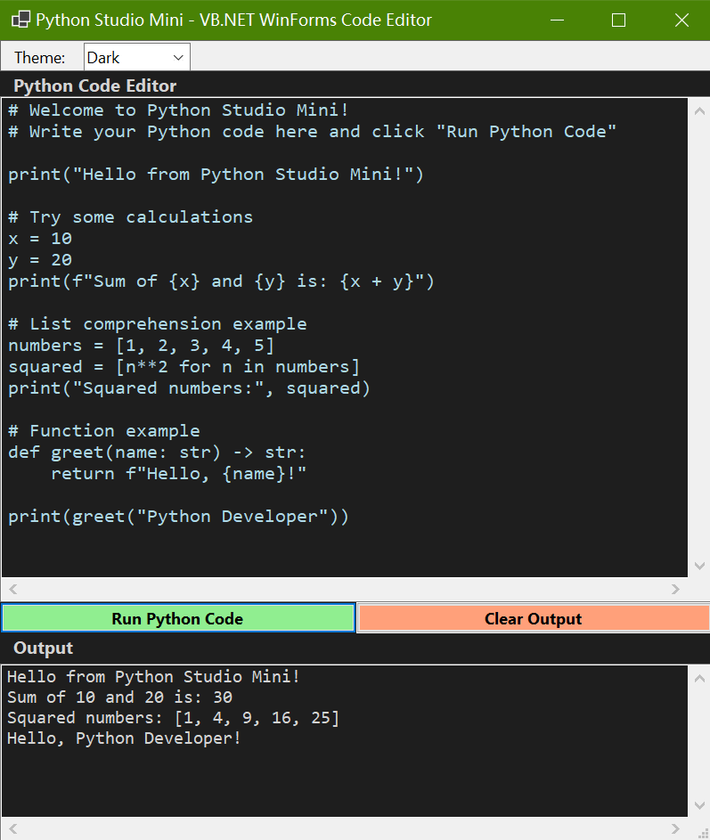

# Python Studio Mini - VB.NET WinForms Code Editor

A modern, feature-rich Python code editor, built with VB.NET WinForms, equipped with real-time code execution and a relatively simple user interface.



## Features

- 🌙 **Dual Themes**: Light and dark themes for comfortable coding in any environment
- ⚡ **Real-time Execution**: Run Python code directly in the editor and see output instantly
- 🎯 **Sample Code**: Pre-loaded with example code to help you get started quickly
- 🔒 **Type Safety**: Built with Option Strict On for enhanced type safety and reliability
- 🐍 **Python.NET Integration**: Seamless integration with Python using Python.Runtime for powerful execution

## Requirements

- [.NET SDK 10](https://dotnet.microsoft.com/en-us/download/dotnet/10.0) or later
- [Python 3.14](https://www.python.org/downloads/release/python-3140/) or later installed
- **IDE**: Visual Studio 2026, Visual Studio Code, or any other .NET-compatible IDE

## Getting Started

1. Clone or download the repository:
```bash
git clone https://github.com/Pac-Dessert1436/Python-Studio-Mini-VB.git
```
2. Open the solution in Visual Studio or your preferred IDE.
3. Build and run the application:
```bash
dotnet build
dotnet run
```
4. Start writing and executing Python code!

## Usage

1. **Write Code**: Use the top text editor to write your Python code
2. **Run Python Code**: Click the "Run Python Code" button to execute your code
3. **View Output**: See the results in the bottom output window
4. **Clear Output**: Click the "Clear Output" button to reset the editor and output
5. **Change Theme**: Select between Light and Dark themes from the dropdown

## Example Code

```python
print("Hello from Python Studio!")

# Try some calculations
x = 10
y = 20
print(f"Sum of {x} and {y} is: {x + y}")

# List comprehension example
numbers = [1, 2, 3, 4, 5]
squared = [n**2 for n in numbers]
print("Squared numbers:", squared)

# Function example
def greet(name: str) -> str:
    return f"Hello, {name}!"

print(greet("Python Developer"))
```

## Technical Details

- **Language**: VB.NET with Option Strict On for type safety
- **Python Integration**: Uses Python.Runtime library for strongly-typed Python API access
- **Syntax Highlighting**: Custom implementation that highlights:
  - Keywords (blue)
  - Strings (green)
  - Comments (gray)
- **Theme System**: Full theme support with automatic syntax highlighting adjustment

## Project Structure

```
Run-Python-in-WinForms/
├── frmMain.vb              # Main form with all editor functionality
├── Program.vb              # Application entry point
├── README.md               # This file
├── Python Studio Mini VB.sln    # Visual Studio solution
└── Python Studio Mini VB.vbproj # Visual Studio project
```

## Contributing

Feel free to submit issues and enhancement requests!

## License

MIT License - see [LICENSE](LICENSE) file for details
